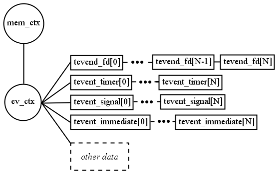

## 1 Tevent context

### 1.1 Tevent 上下文

Tevent 上下文是 Tevent 库的一个重要逻辑单元。为了处理事件，必须至少创建一个这样的上下文 —— 分配、初始化。然后，要捕获和处理的事件必须在这个特定的上下文中注册。将事件从属于 tevent 上下文结构的原因在于，可以创建多个上下文，并且每个上下文都在不同的时间进行处理。因此，可能有一个上下文只包含文件描述符事件，另一个上下文负责信号和时间事件，第三个上下文保存其余事件的信息。

Tevent 循环是库的一部分，它代表了注意事件和触发处理程序实际发生的机制。他们只接受一个参数 —— tevent 上下文结构。因此，如果理论上调用了无限循环（tevent_loop_wait），那么只有属于传递的 tevent 上下文结构的参数才能在该调用中被捕获和调用。尽管注册了更多的信号事件（但在某些其他上下文中），但它们不会被注意到。

#### 1.1.1 实例

处理 mem_ctx 的第一行属于 talloc 库知识，但由于 tevent 使用 talloc 库来实现其机制，因此也有必要了解一点 talloc。有关使用 talloc 的更多信息，请访问 talloc 网站，那里有教程和文档。

Tevent 上下文结构 *event_ctx 表示将进一步包含关于已注册事件的信息的单元。它是通过调用 tevent_context_init() 创建的。

```c
TALLOC_CTX *mem_ctx = talloc_new(NULL);
if (mem_ctx == NULL) {
    // error handling
}
struct tevent_context *ev_ctx = tevent_context_init(mem_ctx);
if(ev_ctx == NULL) {
    // error handling
}
```

上下文具有包含大量信息的结构。它包括所有事件的列表，这些事件根据其类型进行划分，并按顺序显示它们发生的顺序。




除了图中显示的列表外，tevent 上下文还包含许多其他数据（例如，关于触发回调的可用系统机制的信息）。

### 1.2 Tevent loops

Tevent 循环是事件的调度器。他们抓住他们并触发处理人员。在较长进程的情况下，程序此时会花费大部分时间等待事件、调用处理程序并再次等待另一个事件。tevent 库中有两种类型的循环可供使用：

- int tevent_loop_wait()
- int tevent_loop_once()

这两个函数都只接受一个参数（tevent 上下文），唯一的区别在于第一个循环理论上可以永远持续，但第二个循环将只等待一个事件捕获，然后循环中断，程序继续。
