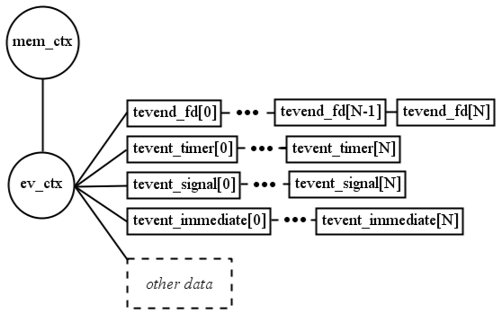

## 4 Tevent request

该库的一个特定功能是 tevent 请求 API，它提供异步计算，并允许功能和事件之间进行更多的互连工作和协作。当处理 tevent 请求时，可以将一个事件嵌套在另一个事件下，并一点一点地处理它们。这使得能够创建步骤序列，并为可能在不同阶段意外发生的所有问题提供了准备的机会。无论如何，子任务会将较大的任务拆分为较小的任务，这样可以更清楚地看到每个任务的整体情况。

### 4.1 命名约定

有一个命名约定不是强制性的，但本教程中遵循了它：
- 在事件发生之前触发的函数。这些建立了一个请求。
- foo_send（…）- 首先调用这个函数，它包括创建 tevent request - tevent req 结构。它不阻塞任何东西，只是创建一个请求，设置一个回调（foo done），继续执行函数。
- 程序作为事件的结果。
- foo_done（…）- 此函数包含用于处理自身的代码，并根据其结果，将请求设置为已完成，或者，如果发生错误，则将该请求设置为失败。
- foo_recv（…）- 此函数包含一些代码，如果需要，这些代码应该访问结果数据并使其更加可见。当请求的处理结束时，应该从内存中释放 foo 状态，因此到目前为止所有计算的数据都将丢失。

如前所述，特定的命名不仅包含函数，还包含数据本身：
- foo_state —— 这是一个结构。它包含异步任务所需的所有数据。

### 4.2 创建新的异步请求

异步工作的第一步是分配内存需求。与前面的情况一样，talloc 上下文是必需的，异步请求将绑定在该上下文上。下一步是创建请求本身。

```c
struct tevent_req* tevent_req_create (TALLOC_CTX *mem_ctx, void **pstate, #type)
```

pstate 是指向私有数据的指针。在此调用过程中分配了必要的内存量（基于数据类型）。在这个相同的内存区域中，异步请求中需要保留一段时间的所有数据都应该保留。

#### 4.2.1 应对记忆力不足

为了识别潜在的内存不足，有必要根据 NULL 验证返回的指针。有一个特殊的函数可以帮助检查 tevent_req_nomem()。

它处理 talloc 内存分配和相关 tevent 请求的验证，因此是避免意外情况的非常有用的功能。在检查 tevent 请求所需的其他内存资源的可用性时，可以很容易地使用它。想象一个例子，尽管当前没有可用的内存资源，但仍需要额外的内存。

```c
bar = talloc(mem_ctx, struct foo);
if(tevent_req_nomem (bar, req)) {
  // handling a problem
}
```

该代码确保变量条（由于内存需求未成功满足而包含 NULL）被注意到，并且 tevent 请求 req 声明它超过了内存容量，这意味着无法按照最初的程序完成请求。

### 4.3 完成请求

将每个请求标记为已完成是 tevent 库的基本原则。如果没有将请求标记为已完成（成功或有错误），tevent 循环就无法触发适当的回调。重要的是要理解这将是一个重大威胁，因为这通常不是一个在屏幕上打印一些文本的单一功能的问题，而是请求本身可能只是一系列其他请求中的一个链接。停止一个请求会停止其他请求，内存资源不会释放，文件描述符可能保持打开，通过套接字的通信可能中断，等等。因此，重要的是要考虑是否成功地完成请求，并为所有可能的情况准备函数，这样回调就不会处理实际上无效的数据，更糟糕的是，实际上不存在这意味着可能会出现分割错误。

- **手动** - 这是最常见的完成请求类型。调用此函数会将请求设置为TEVENT_REQ_DONE。这是该函数的唯一用途，应该在一切顺利时使用。通常，它在 done 函数中使用。
```c
void tevent_req_done (struct tevent_req *req)
```
或者，请求可能会失败。
```c
bool tevent_req_error (struct tevent_req *req, uint64_t error)
```
第二个参数采用错误的编号（由程序员声明，例如在枚举变量中）。函数 tevent_req_error() 将请求的状态设置为 TEVENT_REQ_USER_ERROR，并将错误代码存储在结构中，以便可以使用它，例如用于调试。如果将请求标记为错误的处理没有问题，则该函数返回 true —— 传递给该函数的值错误不等于 1。
- **为请求设置超时** - 请求可以虚拟完成，或者如果过程花费太多时间，则可能超时。这被认为是请求的错误，并导致调用回调。在后台，此超时是通过时间事件设置的（如第 2 章：Tevent 事件所述），该事件最终触发将请求标记为 TEVENT_REQ_TIMED_OUT 的操作（不能被视为成功完成）。如果已经设置了超时，此操作将用新的时间值覆盖它（因此超时可能会延长），如果一切设置正确，则返回 true。
```c
bool tevent_req_set_endtime(struct tevent_req *req,
                            struct tevent_context *ev,
                            struct timeval endtime);
```

- **过早触发** - 想象一下这样一种情况，嵌套子请求的某个部分最终失败，并且仍然需要触发回调。这样的例子可能是由于内存不足，导致无法为事件分配足够的内存来开始处理另一个子请求，或者是由于明显有意跳过其他过程并触发回调，而不管其他进度如何。在这些情况下，函数tevent_req_post() 非常方便，并提供了此选项。
```c
struct tevent_req* tevent_req_post (struct tevent_req *req,
                                    struct tevent_context *ev);
```
以这种方式完成的请求既不是时间事件，也不是文件描述符事件，而是立即安排的事件，因此将根据第2章：Tevent 事件中的描述进行处理。

### 4.4 子请求-嵌套请求

为了创建更复杂和互连的异步操作，可以将一个请求淹没在另一个请求中，从而创建一个所谓的子请求。子请求不由任何其他特殊结构表示，但它们是从 tevent_req_create() 创建的。此图显示了每个请求的嵌套和生存时间。下表用文字描述了相同的内容，并显示了应用程序运行过程中函数的触发。

*Wrapper* 表示整个（子）请求级联的触发器。例如，它可能是一个时间或文件描述符事件，或者由函数 tevent_wakeup_send() 在特定时间创建的另一个请求，这是一种稍微特殊的创建方法

```c
struct tevent_req *tevent_wakeup_send(TALLOC_CTX *mem_ctx,
                                      struct tevent_context *ev,
                                      struct timeval wakeup_time);
```

通过调用该函数，可以创建一个 tevent 请求，该请求实际上是该函数的返回值。总之，它设置了 tevent 请求创建的时间值。使用此函数时，有必要在子请求的回调中使用另一个函数来检查是否存在任何问题（tevent_wakeup_recv（））



嵌套子请求的一个综合示例可以在文件 echo_server.c 中找到。它实现了一个完整的、自包含的 echo 服务器，除了 libevent 和 libtalloc 之外没有任何依赖项。